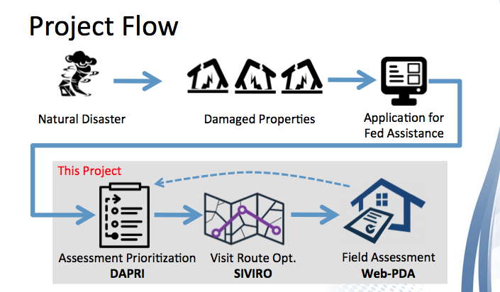

# NLT/FEMA Project

    

## Problem Statement
**Using Google Street View as a baseline for damage assessment**

During the recovery phase immediately following a disaster, FEMA performs damage assessment “on the ground” to assess the level of damage caused to residential parcels and to critical infrastructure. To assure an accurate estimation of the damage, it is important to understand the condition of the structures prior to the event. To help and guide the damage assessment efforts following a disaster and to assist the surveyors identify the structures of interest, this tool (a web-app or a mobile app) will:
- Get a list of addresses as an input
- Retrieve pre-disaster screenshots of the damaged structures from Google Street View
- Design a damage assessment form to help and guide the assessment efforts

Other features "suggested" by the client that we incorporated in the tool:
- Prioritize damage assessment efforts
- Suggest the closest route between damaged locations and propose the sequence of visits

**The Client**:

- [New Light Technologies](https://newlighttechnologies.com/) is a small, award-winning organization based in Washington, D.C. that provides solutions to government, commercial, and non-profit clients. NLT is a team of dedicated technologists, scientists, engineers, designers, and strategists working on some of the most interesting, challenging, and important assignments in the world, ranging from disaster response to enabling growing telecommunications networks to providing healthcare to Americans. Some of the organizations they work with include FEMA (the Federal Emergency Management Agency), USAID (the United States Agency for International Development), the U.S. Census Bureau, and The World Bank.

## Background Information About Post-Disaster Damage Assessment Efforts

FEMA has declared 55 natural events as disasters in 2019 alone.

According to FEMA, there are two types of disaster declarations: emergency and major. Emergency declarations are to supplement state and local government efforts and come with a budget that cannot exceed $5 million. Major disaster declarations provide federal assistance programs for individuals (housing, food, unemployment assistance, etc.) and the public (debris removal, road and bridges, water control facilities, etc.).

Before declaring a natural event as a Major disaster, FEMA considers the following: Concentration of damage- areas with high concentrations of damage indicate a greater need
Trauma- limited/no access to water and/or power and number of deaths and injuries
Special populations- impact on elderly, low-income, and unemployed communities/people
Voluntary agency assistance- impact on local community groups and religious organizations
Insurance- insurance coverage is taken into consideration
Damaged residences- evaluation of the total number of homes destroyed/damaged and accessibility

When state and local government officials apply for federal aid for disaster relief, FEMA has to perform a joint preliminary assessment. During this assessment, FEMA evaluates the total number of properties impacted, accessibility, and overall impact on the community. Once a natural event has been declared a disaster, FEMA performs another damage evaluation to properly assess the level of damage caused by said disaster.

We need to develop a web-based tool and phone application that allows FEMA assessors to retrieve pre-disaster photos of damages, digitize FEMA’s current assessment forms in order to modernize the assessment process, prioritize areas effected based on impact, and finally optimize routes between sites.

## Data Description
Data is supplied by the user. The web application will take information from the user and obtain additional information using the Google and Zillow APIs. The data is then stored on a SQL database on the website.

Web Application:
 * User imputed information:
   * Address (unformatted)
   * Applicant assessment
   * Main building damage (select field)
   * Main exterior damage
   * Main interior damage
   * Other building damage (select field)
   * Other exterior damage
   * Other interior damage
   * Agent assessment estimate
   * Type of disaster (select field)
   * Name of disaster
   * Other notes
 * Google Street View photo
 * Address of the property (properly formatted)
 * Property Latitude and Longitude
 * Zillow Price Estimate
 * Zillow Bedrooms
 * Zillow Bathrooms

DAPRi and Interactive Maps:
 * Address supplied by User
 * Coordinates obtained by Google geocode API

## Project Flow

This project is brokwn down into multiple steps, and for each step, we have developed a tool. These tools are meant to be part of one platform, which we called "Web-PDA" (Web-based Preliminary Damage Assessment). The three tools, namely DAPRI, SIVIR, and Wenb-PDA, have been separately developed and are functionaly. Due to a very tight schedule for this project, our team was not able to fully incorporate all features in the flask app. We are hoping that the next cohort would be able to integrate all these tools in one platform and add other functionalities.

Sections below will describe these tools.

## Damage Assessment Prioritization (DAPRI) Tool
### Objective of the tool
Given a list of properties including the address, lat/long, damage level, damage comments, the applicant's estimate of the damage (in $$), and other information, prioritize the properties for site visit and damage assessment. The idea is to prioritize properties that are in higher need of assessment for receiving funds sooner.

### Summary of DAPRI Algorithm
DAPRI's algorithm is based on a `Priority Index (PI)` for each property that is calculated as:

            Priority Index =   (Damage Level)
                             * (Home Safe To Live)
                             * (Level of Access to Utilities)
                             * (Level of Insurance Coverage)
                             * {(Application Estimate) / (Estimated Home Value)}

It should be noted that we made the assumption about what priority means in this context, what factors should be considered, and how they should be combined to get the priority index. However, the prioritization algorithm works disregarding how the PI is calculated. The client can change the equation based on their considerations by adding or removing factors or by assigning weights to different factors.

#### Damage Level (scale 0-3):
When looking at property damage levels, it should be noted that according to FEMA there are four levels of damage (shown in the table below). Damage levels are assigned on a scale of 1~4 according to these levels.

| FEMA Damage Level | Score |
|-------------------|------------------------|
| Destroyed | 3|
| Major | 2 |
| Minor | 1 |
|Affected with an Inaccessible category for the homes that cannot be reached for assessment| 0|

**NOTE:** The reason inaccessible properties are scored at 0 for their damage level is that they cannot be reached for assessment, and until they become accessible they are prioritized as '0' (or low priority) for the time being.

This means, these properties will be pushed to the end of the list, until they become accessible after which the prioritization should be run with the revised damage levels.

#### Home Safe to Live (scale 1-2):
This takes into account if the damaged home is safe to live in or not. Some levels of damage may or may not lead to unsafe situations. Those properties that are no longer safe to live in get higher priority.

|Safe to Live | Score |
|------------|-------|
|Yes| 1|
|No|2|

#### Access to Utilities (scale 1-3):
Those properties that have lost access to basic utilities, or have partial access to utilities get higher priority.

|Level of Access to Utilities | Score|
|-----------------------------|------|
| Full access to all utilities| 1|
|Partial access to utilities | 2|
| No access to utilities | 3|

#### Level of Insurance Coverage (scale 0 to 1, float):
Those properties that have full or partial coverage get lower priority than those which do not have any insurance coverage for the type of disaster.

|Level of Insurance Coverage| Score|
|-----------------------------|------|
| Full Coverage| 0|
|Partial Coverage | 1|
| No Coverage | 2|

#### Damage Estimate over Estimate Home Value
This metric provides a ratio of the level of damage (in monetary value) provided by the applicant over the total home value. Properties that have suffered significant damage compared to their total value will get higher priority. The reason the damage estimate is divided by home value is to remove any bias toward wealthy neighborhoods, where a minor damage may cost more than a total price in under-privileged areas. Therefore, the focus will be on the portion of the home value that was affected by the damage, as opposed to the total damage cost.

### Steps for Prioritization:
- Calculate a `Priority Index` (PI) for each property
- Cluster properties based on their lat/long (DBSCAN)
- Calculate average of PI for each cluster
- Sort clusters based on their average PI
- Sort properties in each cluster based on their individual PIs

### Interactive HTML-Based Maps
The goal was to build well-rounded web-based/phone applications, to do so, we had to turn the maps created in the Jupyter notebook into HTML form. Using Google Maps Cloud Platform APIs, we implemented JavaScript, MySQL database, PHP, and XML. Those tools were used to do the following: cluster properties effected based on proximity, create heatmaps based on the amount of damage (weighted), and markers that display information about each property. It was important for us to use the Google JavaScript API, SQL, PHP, and XML because they can act as a server/database, which is important for real-world use.

## Site Visit Route Optimizer (SIVIRO)
## Solution #1: TSP and Genetic Algorithms

#### Objective of SIVIRO:
This notebook is developed for optimizing a route based on driving distance (duration in seconds) between an origin, to a destination, and with multiple waypoints (or intermediate stops). The purpose is to help a FEMA agent plan the site visit to multiple properties for damage assessment.

#### Summary of the Algorithm:
The algorithm developed in this notebook is based on the concept of **Traveling Salesman Problem (TSP)** route optimization, and leverages **Genetic Algorithm**, **brute force**, and **Unsupervised Clustering** for this purpose. Multiple libraries have been used in this notebook. More details are provided in each section.

The optimization was done based on the driving duration (in seconds) for one point to another, and the goal was to get the minimum total driving duration between the points of interest without visiting each point more than once. The code is flexible where the user can enter the origin and final destination addresses, and also the points of interest in between, and have the tool optimize the trip.

We also leveraged unsupervised clustering of property locations based on their latitude and longitude and the driving duration between properties. KMeans clustering was used, but we concluded it would not be a viable solution in this case because we were interested in neighborhood clusters based on driving distance and not Euclidean distance.
DBSCAN and Hierarchical clustering were also used based on driving time (distance) matrix and `precomupted` distance option. They both yielded the same results, but DBSCAN is computationally more efficient.

The code then used the TSP concept to find the most optimized route. We used the `mlrose` package and its genetic algorithm feature for this purpose. This package is developed at Georgia Tech University for conducting optimization calculations. We also used 20 different values for parameters in the genetic algorithm.

The model uses brute-force to evaluate all options and thus for 12 points and 12 parameters over 9.6 billion route combination were evaluated. The results showed significant improvement in the total driving duration due to optimization.

The outcome of the tool is the sequence of property visits to achieve the minimum driving distance. This information can be passed onto Google Maps to get the directions between these points.

## Web-PDA
The backbone of our web form was constructed with Flask and its bevy of libraries.  Using a sprawling structure of decorators, classes and subclasses, we were able to integrate Google’s Street View and Zillow’s APIs with our algorithms to extract property images and value estimates, to live alongside the assessment information for each site.  

Utilizing SQLAlchemy, all of our inputs are able to be assigned to a database to be accessed at a later date, including the Google Street View image file link, that can be accessed from our server.  The application comes alive in the web form via HTML and is largely constructed through Flask via Jinja2, which allows us to run our database queries.

## APIs and Object-Oriented Programming

The project makes use of two APIs, google and zillow.  Within the google APIs, we made use of the Geocoding API, Street View Static API, and Directions API.  The geocoding api helped us get coordinates as wells as proper addresses and city names. The street view static api is was allows us to grab pictures of any given location. This will serve as the pre-diaster pictures in the event of a natural disaster. The direction api was used in the traveling salesman problem, which we called “SiViRO.” After our route was optimized, we could use the directions api to return directions back to our app.  The zillow api was used in obtaining housing price estimates, as well as the number of bedrooms and bathrooms for each property. Both APIs are free and open to the public (with restrictions).

The use of object oriented programming was essential to this project. We transitioned from coding from a Jupyter Notebook to a more product ready integrated development environment. While coding from in a Jupyter Notebook is very helpful, we realized that we would need a more generalized environment for wider applications.  In combination with the Flash App, python scripts could be run behind html, which would allow the end user to access our app through a web browser.

## Next Steps

While our team has accomplished a lot in a two week time period, there are is still a lot to consider and to add to this project.  To create a universal tool for the field assessor, our final product would ideally integrate these features into our web form:
- Accept application submissions from the public after a disaster
- Import road closure information from other projects as another input to our route optimizer algorithm (SIVIRO)
- Integrate SIVIRO and our prioritization algorithm (DAPRI) into our web form
- Allow for greater pre-disaster image capturing via Google Street View angle configuration or satelite images
- Build a phone application that will store assessment information locally, in case internet access is not possible

In addition to the web form’s capabilities, DAPRI and its route prioritization should continue to be evaluated due to potential ethical issues for addressing assessment priority.  We also did not have the ability to discuss the primary concerns that FEMA considers when trying to prioritize their assessment efforts.  Gathering the necessary feedback would allow us to implement a better algorithm here.

Finally, user experience of our form would need to be addressed.  Our Data Science team has limited experience in HTML, CSS, and Javascript, so additional research and self-training here would ensure a more attractive and easier to use web form for the assessor and the general public.

# Resources
FEMA:
 * [FEMA](https://www.fema.gov/disaster-declaration-process)
 * [Manual for FEMA Preliminary Damage Assessment Form](https://www.fema.gov/media-library-data/1459972926996-a31eb90a2741e86699ef34ce2069663a/PDAManualFinal6.pdf)
 * [FEMA Adjuster Preliminary Damage Assessment (PDA) Form](https://mil.wa.gov/preliminary-damage-assessment-forms)

Flask:
 * [Flask Documentation](https://flask.palletsprojects.com/en/1.0.x/)
 * [SQLAlchemy Documentation](https://docs.sqlalchemy.org/)
 * [Miguel Grinberg Tutorial](https://blog.miguelgrinberg.com/post/the-flask-mega-tutorial-part-i-hello-world)

Google API:
 * [Street View Static API](https://developers.google.com/maps/documentation/streetview/intro)
 * [Geocoding API](https://developers.google.com/maps/documentation/geocoding/start)
 * [Directions API](https://developers.google.com/maps/documentation/directions/start)
 * [Interactive Maps](https://developers.google.com/maps/documentation/javascript/heatmaplayer)

Zillow API:
 * [Documentation](https://www.zillow.com/howto/api/GetSearchResults.htm)

Route Optimization:
 * [MLROSE package by Georgia Tech](https://pypi.org/project/mlrose/)
 * [Traveling Salesman Problem](https://en.wikipedia.org/wiki/Travelling_salesman_problem)
 * [Genetic Algorithm](https://en.wikipedia.org/wiki/Genetic_algorithm)

Object Oriented Programming:
 * [Wikipedia](https://en.wikipedia.org/wiki/Object-oriented_programming)

Past Projects:
* [Github DSI-DC-6](https://github.com/Mauriekathan/Image_Geo_Team_Street_View)
* [Github DSI-DC-7](https://github.com/wkarney/street_viewing_for_FEMA)
